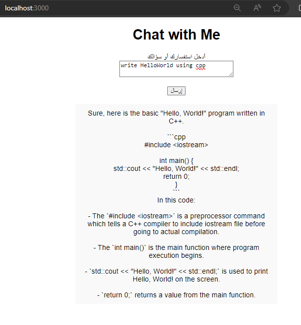

# fifth task 
* **OverView** 
    * this task is about how to build a chatbot using Python or Nodejs with OpenAi API key.
    * i'm going to build this chatbot using NodeJS  

* **Dependencies**
    * NodeJS
    * npm package manager
    * body-parser cors
    * JavaScript express 
    * JavaScript axios
    * JavaScript path  

* Insall all the Dependencies
    * to inatall NodeJS and npm packager manager 
        * go to NodeJS website and install the LTS version here is the [link](https://nodejs.org/en)  after you intall NodeJS and npm you can use npm command to install all other Dependencies
    
    * to install body-parser you run this command in PowerShell or in Windows Subsystem for Linux (WSL) terminal **but run this in same project folder**  
    ```SH
        cd path/to/your/project #for example 
        npm install body-parser cors
    ```  

    * to install JavaScript express you run this command in Windows Subsystem for Linux (WSL) terminal **but run this in same project folder**  
    ```SH
        npm install express
    ```  

    * to install JavaScript axios you run this command in Windows Subsystem for Linux (WSL) terminal **but run this in same project folder**  
    ```SH
         JavaScript axios
    ```  

    * to install JavaScript path you run this command in Windows Subsystem for Linux (WSL) terminal **but run this in same project folder**  
    ```SH
        npm install path
    ```  

    * after you install all the Dependencies you will need to install last thing called package.json its important get start the project 
    ```SH
        npm init
    ```  

* **files we have**
    * first is package.json is used for data interchange between a server and a web application and has like a pointer to JavaScript file that well we use to hold the API key  

    * second file is package-lock.json it contain all the Dependencies we have installed 

    * third file is server.js this file contain so many thing let me expain each thing 
        * first we will define all the configuration 
        ```JS
            const express = require('express');
            const bodyParser = require('body-parser');
            const axios = require('axios');
            const cors = require('cors');
            const path = require('path');

            const app = express();
            const PORT = 3000; // here the file will use this port 

            app.use(bodyParser.json());
            app.use(cors()); // Allow cross-origin requests
            app.use(express.static(path.join(__dirname, 'public'))); // this is a folder contain html file 
        ```
        after the uses the port it will create a localhost server and request public folder to open html file  

        * second create anonymous functions to use API key, define the model that we will use, takes the arguments and print out the reponse on the html page
        ```JS
            app.post('/api/chat', async (req, res) => {
            const prompt = req.body.prompt;
            const apiKey = ''; // Replace with your OpenAI API key
            const endpoint = 'https://api.openai.com/v1/chat/completions';
            const headers = {
                'Content-Type': 'application/json',
                'Authorization': `Bearer ${apiKey}`
            };

            const data = {
                model: 'gpt-4', // this the model that we will use 
                messages: [
                    { role: 'system', content: 'You are a helpful assistant.' }, // this will show after run the code as Welcome message
                    { role: 'user', content: prompt } // this take the argument from a user 
                ],
                max_tokens: 150
            };

            try {
                const response = await axios.post(endpoint, data, { headers });
                res.json({ response: response.data.choices[0].message.content.trim() }); // here will print out the response 
            } catch (error) {
                console.error('Error fetching response from ChatGPT-4:', error.message);
                res.status(500).json({ error: 'Sorry, an error occurred while fetching the response.' });
            }
        });
        ```  

        * third we make the file listen to the defined port using an anonymous function
        ```JS
            app.listen(PORT, () => {
                console.log(`Server is running on http://localhost:${PORT}`);
            });
        ```  
    
    * last file we have is the index.html file it has inside it its design also has embeded JavaScript
        * first the sturcture 
        ```HTML
        <div align="center">
        <h1>Chat with Me</h1>
        <form id="chatForm">
            <label for="prompt">أدخل استفسارك أو سؤالك</label><br>
            <textarea id="prompt" name="prompt" rows="2" cols="30"></textarea><br><br>
            <input type="submit" value="إرسال">
        </form>
        <div id="response"></div>
        </div>
        ```
        the form this will used by the embeded script also the second div it hold the response that came from the model  

        * the embeded script 
        ```HTML
            <script>
                document.getElementById('chatForm').addEventListener('submit', async function(event) {
                    event.preventDefault();
                    const prompt = document.getElementById('prompt').value;

                    try {
                        const response = await fetch('http://localhost:3000/api/chat', {
                            method: 'POST',
                            headers: {
                                'Content-Type': 'application/json'
                            },
                            body: JSON.stringify({ prompt })
                        });
                        const data = await response.json();
                        document.getElementById('response').innerText = data.response;
                    } catch (error) {
                        document.getElementById('response').innerText = 'Error: ' + error.message;
                    }
                });
        </script>
        ```
        first it will take the argument from the user and sends it to server.js file the will process the arugment and produce the equvalent response  
        second the output it will shows at second div tage the output it will eihter the response or the error message  

* **To start the chatbot you use this command on terminal**
    ```SH
        node server.js
    ```

    if its work correctly you will this output  
    

    and the final result it will should look like that also i asked the model to write a simple C plus plus code  
    
