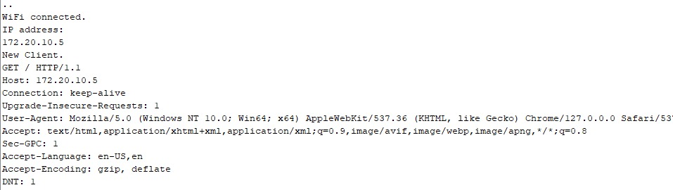
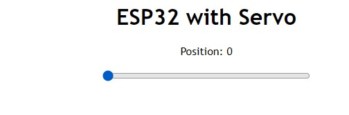
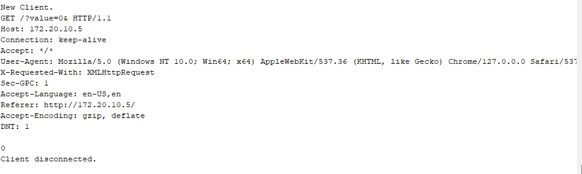
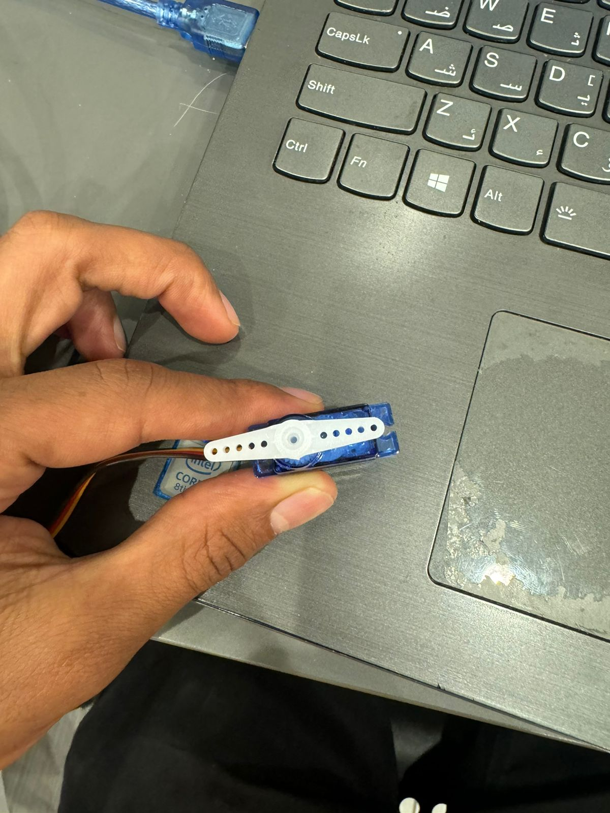
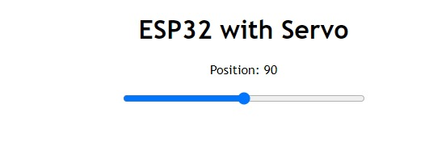
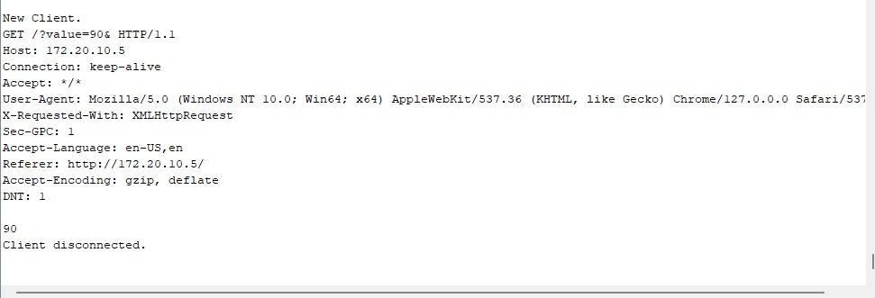
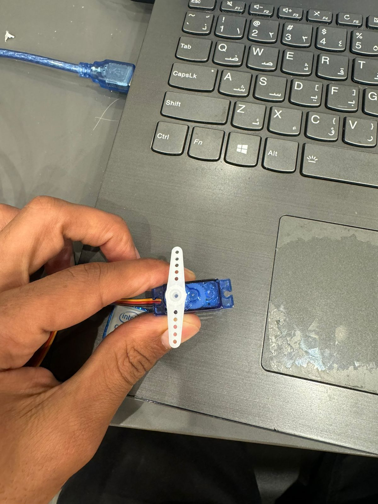
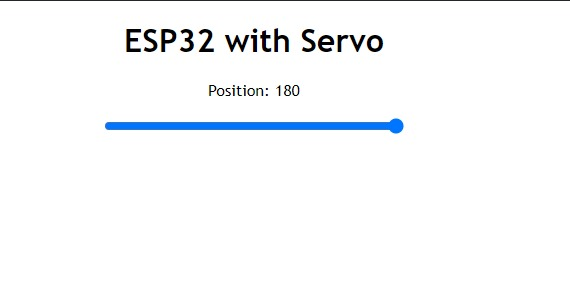
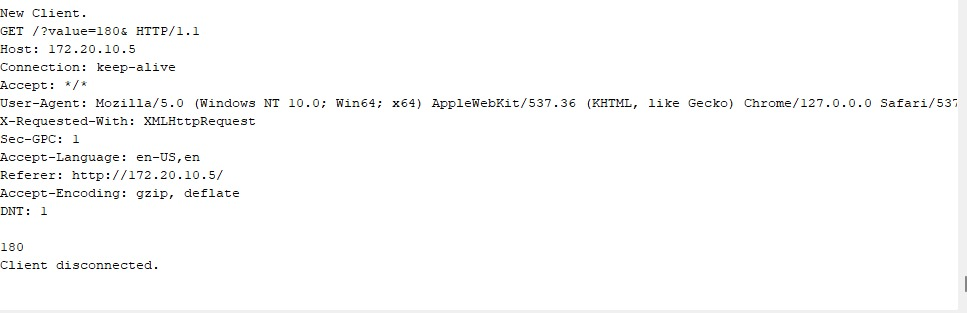
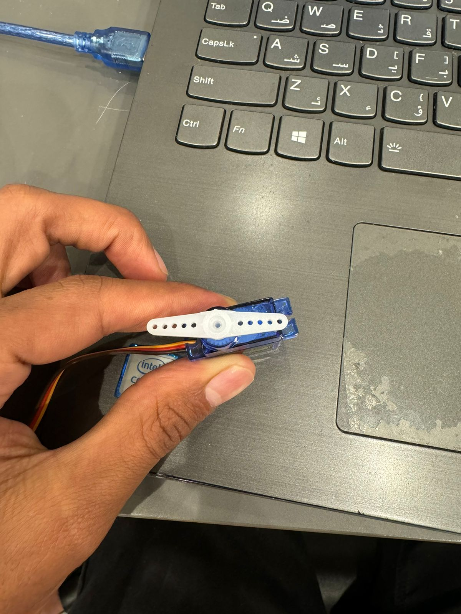

# last task  

* **OverView** 
    * this task based on control servo motro with web interface using ESP32

* **Dependencies**
    * Arduino IDE 1.18.* or above

* **How its work**
    * we need only esp32, servo and jumper wires
    
    * connect servo with esp32 in any pin that is a signal input/output

* **Output**
    * i tried 3 different values  
    but first i we open a serial we should get this output  
      
        * then first output  
          
          
          

        * then second output  
          
          
          

        * then third output  
          
          
        
